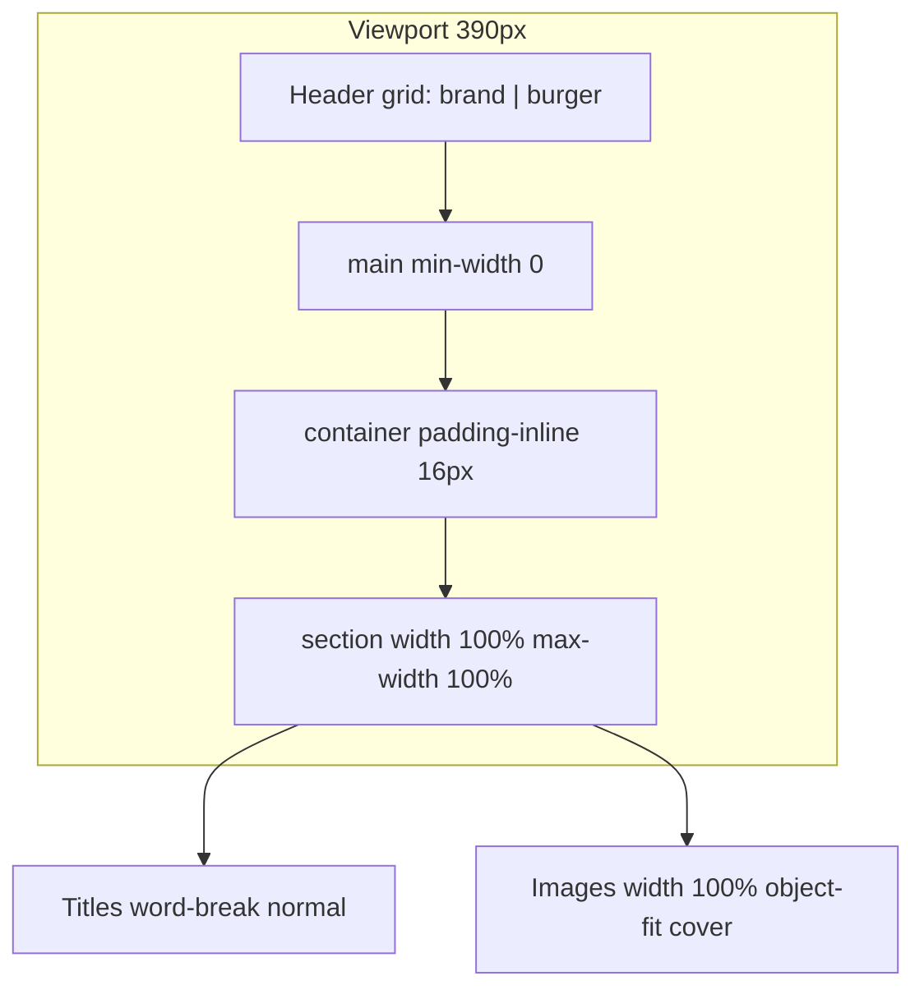

# Design Skill — Scandinavian Premium Service Site

> Універсальна інструкція для створення та підтримки дизайну в стилі цього проєкту: світла скандинавська естетика, контрастні hero-блоки, акцентна «мідь/бронза», строгі caps-написи, editorial-сітка, mobile-first без горизонтального overflow.

**Стек-референс:** Django + HTML partials + окремі CSS-файли + HTMX (опційно).  
**Мова UI:** українська.  
**Цільові viewport:** 320 / 375 / 390 / 414 / 768 / 1024 / 1280 px + iOS Safari (`viewport-fit=cover`).

---

## 1. Коли застосовувати цей skill

Застосовуй **завжди**, коли:

- створюєш новий сайт послуг (B2C, premium, local business);
- додаєш сторінку, секцію, компонент або правиш верстку в цьому стилі;
- переносиш дизайн-систему в інший проєкт з тим самим візуальним кодом;
- агент або розробник «ламає» mobile, header, типографіку чи overflow.

**Не застосовуй** для: SaaS dashboard, neobrutalism, glassmorphism-heavy UI, rounded-card apps, dark-only themes.

---

## 2. Дизайн-філософія (не порушувати)

| Принцип | Реалізація |
|--------|------------|
| Скандинавська стриманість | Багато повітря, мало декору, прямі кути (`--radius: 0`) |
| Преміальність | Великі display-заголовки, якісні фото, контраст dark hero + light body |
| Читабельність | Body — Inter; заголовки/кнопки — Montserrat |
| Ієрархія | Eyebrow → Title → Lead → Actions; caps-labels для навігації |
| Довіра | Статистика, badge «років досвіду», checklist, CTA «безкоштовний кошторис» |
| Mobile-first | Спочатку 320px, потім tablet/desktop; без «desktop-only» критичного контенту |

**Візуальний характер:** теплий cream фон, charcoal текст, bronze accent, тонкі 1px borders, без тіней «material card» (окрім hover на service cards).

---

## 3. Design Tokens (обов'язкові значення)

### 3.1 Brand palette (`site-theme.css`)

```css
--home-bg: #f2ece3;
--home-dark: #1a1714;
--home-accent: #8c5d28;
--home-accent-hover: #a06b30;
--home-accent-soft: #c4a27a;
--home-muted: #635b52;
--home-border: #d6cfc5;
--home-svc-bg: #ece5d9;
--home-cream: #f2ece3;
```

**Semantic mapping:**

- Фон сторінки → `--home-bg`
- Основний текст → `--home-dark`
- Другорядний текст → `--home-muted`
- CTA / active nav / eyebrow accent → `--home-accent`
- Рамки → `--home-border`
- Альтернативний фон секцій (services) → `--home-svc-bg`
- Текст на dark hero → `--home-cream` + `rgba(242,236,227,0.72)` для lead

### 3.2 System tokens (`tokens.css`)

- `--space-base: 8px` — базова одиниця
- `--space-gutter: 24px` desktop / **16px mobile** (перевизначити в `@media max-width 767px`)
- `--container-max: 1280px`
- `--header-height: 88px` desktop / **72px mobile**
- `--home-section-pad: 80px` desktop → **64px tablet → 52px mobile**
- `--text-label-caps: 0.75rem` + `--ls-label: 0.15em`
- `--radius: 0` — **без скруглень** (фірмовий стиль)
- Safe area: `--safe-top/right/bottom/left` через `env(safe-area-inset-*)`

### 3.3 Typography

| Роль | Шрифт | Стиль |
|------|-------|-------|
| Display / H1 hero | Montserrat 800–900 | `clamp()`, negative letter-spacing |
| Section title | Montserrat 800 | `clamp(1.85rem, 3.2vw, 2.6rem)` |
| Body | Inter 400 | `0.975rem`, `line-height: 1.72` |
| Labels / nav / buttons | Montserrat 700 | UPPERCASE, `letter-spacing: 0.1–0.15em` |
| Icons | Material Symbols Outlined | weight 300, `opsz 24` |

**Google Fonts (мінімум):** Montserrat 400–900, Inter 400–700.

---

## 4. Архітектура CSS (строго дотримуватися)

### 4.1 Порядок підключення (`base.html`)

```
tokens.css → base.css → layout.css → components.css → animations.css
→ responsive.css → site-theme.css → site-ui.css → site-sections.css
→ site-layout.css → site-responsive.css → [page-specific CSS]
```

### 4.2 Відповідальність файлів

| Файл | Що містить |
|------|------------|
| `tokens.css` | CSS variables, z-index, motion |
| `base.css` | Reset, body, typography utilities, `.sr-only` |
| `layout.css` | `.container`, grid utilities, spacing helpers |
| `components.css` | Header, footer, nav, drawer, buttons, legacy cards |
| `animations.css` | `.reveal`, HTMX indicators |
| `responsive.css` | Global mobile overrides, header grid, overflow-x clip |
| `site-theme.css` | Brand overrides для `.site-page` |
| `site-ui.css` | Eyebrow, titles, buttons, links, checklist |
| `site-sections.css` | About, services, portfolio, stats, CTA sections |
| `site-layout.css` | Inner page hero, filter bar, prose, forms layout |
| `site-responsive.css` | Shared section responsive |
| `pages/home.css` + `home-responsive.css` | Тільки головна |
| `pages/portfolio.css` | Тільки портфоліо |

### 4.3 Правила організації CSS

1. **Один concern — один файл.** Не змішувати header і portfolio в один файл >500 рядків.
2. **Mobile-first для layout-grid:** базово `grid-template-columns: minmax(0, 1fr)`, desktop — `@media (min-width: 1024px)`.
3. **Cache-bust:** `?v=N` при зміні CSS у шаблонах.
4. **Токени замість hex** у компонентах (hex лише в `tokens.css` / `site-theme.css`).
5. **Не дублювати** однакові блоки в `home-2.css` і `site-sections.css` — один source of truth.

---

## 5. HTML / Django структура

### 5.1 Каркас сторінки

```html
<body class="site-page ">
  
  <main></main>
  
</body>
```

- Головна: `home-page`
- `lang="uk"`, viewport: `width=device-width, initial-scale=1, viewport-fit=cover`

### 5.2 Обов'язкові partials

| Partial | Призначення |
|---------|-------------|
| `header.html` | Logo + desktop nav + burger |
| `logo_brand.html` | Icon + wordmark (2 рядки з context) |
| `footer.html` | 4-col grid + copyright full-bleed divider |
| `mobile_nav.html` | Drawer + close btn + nav links |
| `page_hero.html` | Inner pages hero |
| `page_cta.html` | Dark CTA block |
| `site_form.html` | Контактна форма |

### 5.3 Naming convention

- **Site shell:** `site-*` (header, container, page-hero, filter-bar)
- **Marketing/home blocks:** `home-*` (hero, services, portfolio, cta)
- **BEM-подібність:** `block__element--modifier` без надмірної вкладеності

---

## 6. Ключові компоненти (рецепти)

### 6.1 Header

**Desktop:** logo (icon 64px) + wordmark + horizontal caps nav + primary CTA.  
**Mobile:** CSS Grid `grid-template-columns: minmax(0, 1fr) auto` — burger **завжди видимий**, `z-index: 2` на actions.

```html
<a class="site-header__brand"></a>
<button class="menu-toggle md-hidden">...</button>
```

- Wordmark: 2 рядки з `site_name_line1/2`, **не** hardcode в шаблоні
- Nav link active: bronze color + 2px bottom border (прозорий border у inactive — без layout shift)
- **Icon header:** 52px mobile / 64px desktop — не стискати під текст

### 6.2 Mobile drawer

- Panel справа, `transform: translateX(100%)` → `0`
- **Header drawer:** title «Меню» + close button (44×44, icon `close`) — **не ховати close внизу**
- Backdrop закриває по кліку (HTMX)
- `body: overflow hidden` коли `.mobile-drawer.is-open`

### 6.3 Hero (головна)

```
.home-hero
  ├── .home-hero__bg (absolute, object-fit cover, opacity ~0.58)
  ├── .home-hero__overlay (gradient dark bottom)
  ├── .home-hero__inner (content + title + lead + actions)
  └── .home-hero__stats (3-col grid, border-top)
```

- Title: **`<br>` дозволені** лише в `.home-hero__title` (не в section titles!)
- Lead: `max-width: 440px`, `overflow-wrap: anywhere` на mobile
- Stats grid: `repeat(3, minmax(0, 1fr))`, зменшити padding на `<360px`

### 6.4 Hero (inner pages)

- `.site-page-hero` — min-height `clamp(280px, 42vh, 420px)`
- Overlay gradient lighter top → darker bottom
- Padding-top: `header-height + 32px`

### 6.5 Section pattern

```html
<div class="home-section-eyebrow">
  <span class="home-eyebrow-line"></span>
  <span class="home-eyebrow-text home-eyebrow-text--accent">LABEL</span>
</div>
<h2 class="home-section-title">Короткий заголовок без br</h2>
<p class="home-text">...</p>
```

### 6.6 About block

- Mobile-first **1 column**; desktop `@1024px`: `minmax(0, 480px) minmax(0, 1fr)`
- Image aspect: `4/3` mobile, `4/5` desktop
- Badge on image: bottom-right, `--home-accent` bg, «12 / Років досвіду»
- Padding grid: `var(--home-section-pad) var(--space-gutter)` — **symmetric**

### 6.7 Services grid

- Background `--home-svc-bg`
- Cards: `home-service-card` + modifiers `--accent` / `--dark` (top border 3px)
- Grid: 1 col mobile, 3 col desktop, `gap: 1px` + border-color trick

### 6.8 Portfolio

- Filter bar: flex wrap mobile / scroll без negative margin
- **Ніколи** `margin-inline: calc(var(--space-gutter) * -1)` на filter bar
- Grid: 2 col mobile, 3 col desktop; items `aspect-ratio: 1` mobile
- Overlay always visible on mobile (`opacity: 0.82`)

### 6.9 Buttons

| Клас | Use |
|------|-----|
| `.home-btn--accent` | Primary CTA (bronze fill) |
| `.home-btn--ghost` | Secondary on dark hero |
| `.btn--primary` | Header / forms (maps to accent via theme) |
| `.btn--block` | Full width mobile |

- Min-height **44px** (touch target)
- Uppercase Montserrat labels

### 6.10 Footer

- Grid 4 columns desktop → stack mobile
- Copyright divider: **full-bleed border** outside `.container` (wrapper `.site-footer__bottom`)
- Social icons: 36×36, bordered squares

---

## 7. Адаптивність (обов'язковий workflow)

### 7.1 Breakpoints

| Breakpoint | Поведінка |
|------------|-----------|
| `max-width: 767px` | Mobile: gutter 16px, header grid, overflow-x clip |
| `768–1023px` | Tablet: 2-col portfolio, reduced section pad |
| `min-width: 1024px` | Desktop: full grids, 480px about image column |
| `max-width: 359px` | Extra compact stats, smaller wordmark |

### 7.2 Overflow prevention (критично)

```css
/* mobile */
html, body { overflow-x: clip; }
main, .container { min-width: 0; max-width: 100%; }
```

На flex/grid children з текстом: **`min-width: 0`**.

### 7.3 Padding discipline

- Горизонтальні відступи **лише** через `var(--space-gutter)` у контейнерах
- **Не mix** `24px` hardcode і `--space-gutter` на mobile
- Секції без `.container` — явний `padding-inline: var(--space-gutter)` + `max-width: var(--container-max); margin: 0 auto`

### 7.4 Grid rules

- Завжди `minmax(0, 1fr)` замість фіксованих `480px` на mobile
- **Заборонено** `grid-template-columns: 480px 1fr` без desktop media query

---

## 8. iOS Safari (обов'язково)

1. `viewport-fit=cover` + safe-area padding на body/header/drawer/footer
2. `-webkit-text-size-adjust: 100%` на mobile
3. Form inputs: **`font-size: 16px`** minimum (запобігає zoom on focus)
4. `-webkit-overflow-scrolling: touch` на scrollable drawer nav
5. `-webkit-tap-highlight-color: transparent` на кнопках
6. Hero height: `100dvh` + fallback `-webkit-fill-available` на body
7. **Не використовуй** `100vw` для full-bleed без `overflow-x: clip` — ризик horizontal scroll

---

## 9. Контент і типографіка

### 9.1 Заголовки секцій

**DO:**

- Короткі фрази, **без `<br>`** у `.home-section-title`
- Природний перенос: `word-break: normal; hyphens: none; text-wrap: balance`
- Альтернативний текст, якщо оригінал довгий:  
  «Майстерність і сучасні технології» замість «Спадщина майстерності та сучасні технології»

**DON'T:**

- **Ніколи** ховати `<br>` через `display: none` без пробілів між inline-нодами — слова злипнуться
- Не використовуй `overflow-wrap: anywhere` на display titles (ламає слова всередині)
- Не став hyphenation auto на українські заголовки без явної потреби

### 9.2 Hero title (виняток)

`<br>` у `.home-hero__title` **дозволені** — окремий компонент, br не ховається.

### 9.3 UI copy

- Мова: **українська**
- Nav / buttons: CAPS через CSS (`text-transform: uppercase`), не ALL CAPS в HTML для accessibility read — допустимо caps в HTML для nav
- Тон: професійний, впевнений, без канцеляризмів

---

## 10. Анімації

- `.reveal` — fade + translateY(24px), Intersection Observer in `main.js`
- `@media (prefers-reduced-motion: reduce)` — вимкнути transform/opacity transitions
- Marquee ticker: `overflow: hidden` на parent, `width: max-content` **тільки** на track всередині
- Hover images: `scale(1.07)` desktop; **disable transform** on mobile (`transform: none`)

---

## 11. Форми

- Класи: `.site-form` / `.home-cta-form__*`
- Labels: caps, small Montserrat
- Inputs: border 1px `--home-border`, focus border `--home-accent`
- iOS: input `font-size: 16px`
- Submit: `.home-btn--accent` full width mobile
- HTMX: CSRF header in `base.html`

---

## 12. Accessibility

- Logo link: `aria-label="{{ site_name }} — на головну"`, img `alt=""`
- Drawer: `role="dialog"`, `aria-modal="true"`, close `aria-label`
- Nav: `aria-label="Головна навігація"`
- Focus states: `:focus-visible` на всіх interactive (не прибирати outline без заміни)
- Contrast: cream on bronze CTA — перевірити WCAG для small text

---

## 13. ОБОВ'ЯЗКОВО (DO)

1. Починати mobile layout з **однієї колонки** і symmetric `padding-inline`
2. Тримати burger visible — grid header, `flex-shrink: 0` на actions
3. Close button у mobile menu **у верхній частині** drawer
4. Використовувати design tokens, не raw hex у компонентах
5. Розділяти CSS за файлами та concerns
6. Додавати `?v=` при зміні статики
7. Тестувати 320 / 375 / 390 / 414 px + iOS safe areas
8. Перевіряти **відсутність horizontal scroll** після кожної секції
9. Wordmark/logo через context processor — single source of truth
10. Inner pages: `page_hero.html` + `site-container` + shared sections
11. Portfolio filters: wrap або scroll **без negative margin**
12. Footer copyright border — full viewport width wrapper
13. `box-sizing: border-box` на containers з padding + width 100%
14. Запускати `test_views` після змін шаблонів

---

## 14. ЗАБОРОНЕНО (DON'T)

1. **`!important`** у CSS (жодних винятків у production CSS)
2. **Inline styles** для layout/spacing/colors
3. **Fixed widths** (`480px` columns) на mobile без media query
4. **`margin-inline: negative gutter`** для «full bleed scroll» без overflow control
5. **Приховувати `<br>`** у текстових заголовках секцій
6. **Злипати слова** — br між словами без пробілів при mobile override
7. **Flex: 1 + nowrap wordmark** без grid — burger зникне під logo
8. **100vw** sections без `overflow-x: clip` на html/body
9. **Зменшувати logo icon** щоб «підігнати» під текст у header (окремо регулюй wordmark)
10. **Дублювати** однакові CSS правила в 3 файлах (home.css, home-2.css, site-sections.css)
11. **Border-radius** «for modern look» — стиль проєкту = radius 0
12. **Material/Google default blue** для primary actions
13. **Heavy box-shadows** на кожній картці
14. **Autogenerated lorem** у production templates
15. **Commit secrets** (.env, keys) — поза scope design, але критично
16. **Файли CSS/HTML >500 рядків** — split на part 1/2/3
17. **Приховувати close** mobile menu лише в bottom CTA
18. **`overflow-wrap: anywhere`** на headings
19. **Desktop-only** critical content (phone, nav, CTA)
20. **Повертати файли** після manual user edits (project rule)

---

## 15. Чеклист перед здачею сторінки

```
[ ] Mobile 390px: header logo + wordmark + burger visible
[ ] Mobile menu opens/closes (X + backdrop)
[ ] No horizontal scroll on home, about, portfolio, contacts
[ ] Section titles: spaces between words, no mid-word breaks
[ ] Hero lead not clipped right edge
[ ] About image: equal left/right gutter
[ ] Portfolio filters fit or wrap cleanly
[ ] Footer divider full width; columns readable
[ ] Forms: 16px inputs on iOS
[ ] prefers-reduced-motion respected
[ ] Cache-bust updated for touched CSS
[ ] Django tests pass
```

---

## 16. Адаптація для нового проєкту (той самий дизайн)

### Крок 1 — Tokens

1. Скопіюй `tokens.css`, `site-theme.css` — зміни лише brand hex (accent, bg, dark).
2. Залиш structure spacing, fonts, radius 0.

### Крок 2 — Shell

1. Скопіюй `base.html`, header/footer partials, mobile nav.
2. Онови `context_processors`: `site_name`, `site_name_line1/2`, `nav_links`, `logo_url`.

### Крок 3 — CSS bundle

1. Підключи файли в **тому ж порядку** (розділ 4.1).
2. Видали page-specific CSS старого домену; створи `pages/{name}.css` за потреби.

### Крок 4 — Content blocks

1. Головна: hero → marquee → about → services → portfolio → stats → CTA.
2. Inner: `page_hero` + `site-container` + optional `page_cta`.
3. Заміни copy, **не** structure classes.

### Крок 5 — QA

1. Прогони чеклист розділу 15 на реальному iPhone Safari.
2. Перевір HTMX partials якщо є dynamic grids/filters.

---

## 17. Швидкий reference класів

```
Shell:     site-page, site-container, site-header, site-footer
Hero home: home-hero, home-hero__title, home-hero__lead, home-hero__stats
Hero inner: site-page-hero, site-page-hero__title
Sections:  home-about, home-services, home-portfolio, home-stats, home-cta
UI:        home-section-eyebrow, home-section-title, home-text, home-btn
Cards:     home-service-card, home-portfolio__item
Nav:       site-nav__link, mobile-nav__link, menu-toggle
Forms:     site-form, home-cta-form
Filters:   site-filter-bar, site-filter-btn.is-active
```

---

## 18. Діаграма потоку layout (mobile)



---

## 19. Версія skill

- **Based on:** Roofing Project (Покрівля під ключ), 2024–2026
- **Last aligned with:** mobile header grid, drawer close, about mobile-first grid, portfolio filter fix, section title typography fix
- **Maintainer:** оновлюй skill після кожної зміни design-system правил у проєкті

---

*Цей документ — єдине джерело правди для AI-агентів і розробників при створенні сайтів у даному стилі. Якщо код і skill конфліктують — спочатку виправ код або онови skill, але не ігноруй обмеження розділу 14.*
